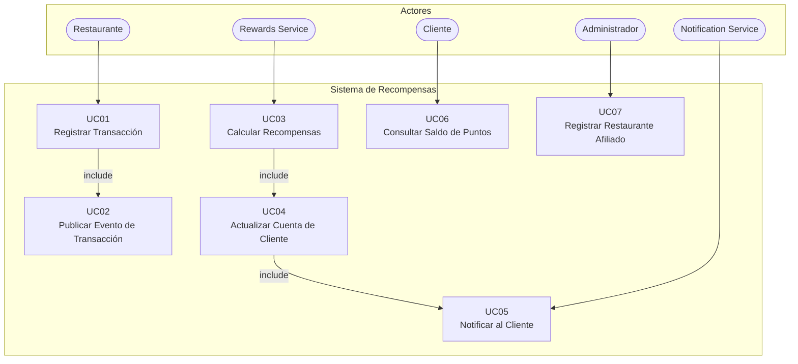

# Documento de Análisis y Diseño
## Sistema de Recompensas para Restaurantes Afiliados

**Laboratorio 8 – Cohesión y Acoplamiento**
**Fecha:** 2026-05-30

---

## 1. Introducción

Los programas de fidelización en restaurantes permiten que los clientes acumulen puntos o cashback cada vez que consumen en locales afiliados. El presente sistema automatiza este flujo mediante una arquitectura orientada a eventos: el restaurante registra una cena, publica un evento en un broker de mensajería y un servicio de recompensas independiente lo consume, calcula los beneficios y actualiza la cuenta del cliente.

El objetivo del diseño es que los dos servicios principales —el **Restaurant Service** y el **Rewards Service**— sean completamente autónomos y se comuniquen exclusivamente a través de mensajes asincrónicos, logrando bajo acoplamiento, alta cohesión y escalabilidad independiente.

**Alcance del sistema:**

- Registro de transacciones de restaurantes afiliados.
- Publicación de eventos de transacción en RabbitMQ.
- Cálculo automático de puntos y cashback por parte del servicio de recompensas.
- Actualización de la cuenta de recompensas del cliente.
- Notificación opcional al cliente al acreditar la recompensa.

---

## 2. Arquitectura

### 2.1 Patrón Arquitectónico

El sistema adopta dos patrones complementarios:

**Event-Driven Architecture (EDA):** los servicios se comunican exclusivamente mediante eventos publicados en RabbitMQ. Ningún servicio llama directamente a otro. Esto garantiza desacoplamiento temporal y espacial.

**Arquitectura Hexagonal (Ports & Adapters) por servicio:** cada microservicio organiza su código en tres capas concéntricas:

```
┌─────────────────────────────────────────┐
│           Infrastructure Layer          │
│  (Adapters: AMQP, REST, SQLite)         │
│  ┌───────────────────────────────────┐  │
│  │        Application Layer          │  │
│  │  (Use Cases / Command Handlers)   │  │
│  │  ┌─────────────────────────────┐  │  │
│  │  │       Domain Layer          │  │  │
│  │  │  (Entities, Ports, Rules)   │  │  │
│  │  └─────────────────────────────┘  │  │
│  └───────────────────────────────────┘  │
└─────────────────────────────────────────┘
```

- **Domain Layer:** entidades, objetos de valor, servicios de dominio y puertos (interfaces abstractas). No depende de nada externo.
- **Application Layer:** casos de uso que orquestan la lógica de dominio. Depende solo del dominio.
- **Infrastructure Layer:** adaptadores concretos (RabbitMQ, SQLite, API REST). Implementa los puertos del dominio.

---

### 2.2 Componentes

| Componente | Rol | Tecnología |
|---|---|---|
| **Restaurant Service** | Expone una API REST para registrar transacciones de cena y publica eventos al broker. Actúa como productor AMQP. | Python 3.12, FastAPI, Pika, SQLite, SQLAlchemy |
| **Rewards Service** | Consume eventos de transacción, aplica reglas de negocio para calcular puntos/cashback, actualiza la cuenta del cliente y publica evento de recompensa acreditada. | Python 3.12, Pika, SQLite, SQLAlchemy |
| **Notification Service** | Consume el evento `reward.credited` y simula el envío de una notificación al cliente (log/email mock). Componente opcional. | Python 3.12, Pika |
| **RabbitMQ Broker** | Gestiona los exchanges, colas y enrutamiento de mensajes entre productores y consumidores. | RabbitMQ 3.x (servidor compartido de la cátedra) |
| **DB Restaurant** | Almacena las transacciones registradas por el restaurante y el catálogo de restaurantes afiliados. | SQLite (desarrollo) |
| **DB Rewards** | Almacena las cuentas de recompensas de los clientes y el historial de recompensas acreditadas. | SQLite (desarrollo) |

**Diagrama de componentes:**

```
┌──────────────────┐     REST POST       ┌────────────────────────┐
│  Cliente HTTP    │ ─────────────────►  │   Restaurant Service   │
│  (Restaurante)   │                     │   ┌────────────────┐   │
└──────────────────┘                     │   │  Domain Layer  │   │
                                         │   └────────────────┘   │
                                         │   ┌────────────────┐   │
                                         │   │  SQLite DB     │   │
                                         └───┤────────────────┤   │
                                             │  AMQP Producer │   │
                                             └───────┬────────┘   │
                                                     │ Publish     │
                                                     ▼             │
                                         ┌───────────────────────┐│
                                         │       RabbitMQ        ││
                                         │  Exchange: tx.direct  ││
                                         │  Queue: rewards.queue ││
                                         │  Queue: notif.queue   ││
                                         └──────────┬────────────┘│
                                                    │ Consume      │
                                         ┌──────────▼────────────┐│
                                         │    Rewards Service    ││
                                         │  ┌────────────────┐   ││
                                         │  │  Domain Layer  │   ││
                                         │  └────────────────┘   ││
                                         │  ┌────────────────┐   ││
                                         │  │  SQLite DB     │   ││
                                         │  └────────────────┘   ││
                                         │  AMQP Consumer+Pub    ││
                                         └──────────┬────────────┘│
                                                    │ Publish      │
                                         ┌──────────▼────────────┐│
                                         │  Notification Service ││
                                         │  (log / email mock)   ││
                                         └───────────────────────┘│
```

---

### 2.3 Topología AMQP

Se utilizan dos exchanges del tipo **direct** para separar claramente los dos flujos de eventos del sistema.

#### Exchange 1: `restaurant.direct`

| Atributo | Valor |
|---|---|
| Nombre | `restaurant.direct` |
| Tipo | `direct` |
| Durable | `true` |

| Routing Key | Cola destino | Consumidor |
|---|---|---|
| `transaction.completed` | `rewards.queue` | Rewards Service |

#### Exchange 2: `rewards.direct`

| Atributo | Valor |
|---|---|
| Nombre | `rewards.direct` |
| Tipo | `direct` |
| Durable | `true` |

| Routing Key | Cola destino | Consumidor |
|---|---|---|
| `reward.credited` | `notification.queue` | Notification Service |

#### Colas

| Cola | Durable | Dead-Letter | Propósito |
|---|---|---|---|
| `rewards.queue` | `true` | — | Recibe eventos de transacción para calcular recompensas |
| `notification.queue` | `true` | — | Recibe eventos de recompensa acreditada para notificar al cliente |

#### Formato del mensaje `transaction.completed`

```json
{
  "transaction_id": "uuid-v4",
  "amount": 85.50,
  "card_number": "4111111111111111",
  "restaurant_code": "REST-001",
  "timestamp": "2026-05-30T20:15:00Z"
}
```

#### Formato del mensaje `reward.credited`

```json
{
  "reward_id": "uuid-v4",
  "transaction_id": "uuid-v4",
  "card_number": "4111111111111111",
  "points_earned": 85,
  "cashback_earned": 4.275,
  "processed_at": "2026-05-30T20:15:03Z"
}
```

#### Flujo completo de mensajes

```
Restaurant Service
      │
      │ basic_publish(exchange="restaurant.direct",
      │               routing_key="transaction.completed",
      │               body=<TransactionEvent JSON>)
      │
      ▼
RabbitMQ [ restaurant.direct ] ──► [ rewards.queue ]
                                           │
                                           │ basic_consume(queue="rewards.queue")
                                           ▼
                                   Rewards Service
                                           │ (calcula puntos y cashback)
                                           │ basic_publish(exchange="rewards.direct",
                                           │               routing_key="reward.credited")
                                           ▼
                             RabbitMQ [ rewards.direct ] ──► [ notification.queue ]
                                                                      │
                                                                      ▼
                                                          Notification Service
```

---

### 2.4 Atributos de Calidad Atendidos

| Atributo | Cómo se atiende |
|---|---|
| **Bajo acoplamiento** | Los servicios no se conocen entre sí; solo conocen el contrato del mensaje (JSON schema). El broker es el único intermediario. |
| **Alta cohesión** | Cada servicio tiene una única responsabilidad: el Restaurant Service gestiona transacciones; el Rewards Service gestiona recompensas. Internamente, cada capa tiene una sola razón de cambio. |
| **Modularidad** | La arquitectura hexagonal separa dominio, aplicación e infraestructura. Se puede cambiar SQLite por PostgreSQL o RabbitMQ por Kafka modificando solo la capa de infraestructura. |
| **Escalabilidad** | Al ser asincrónicos, se pueden ejecutar múltiples instancias del Rewards Service consumiendo la misma cola sin modificación. RabbitMQ balancea los mensajes entre consumidores. |
| **Resiliencia** | Las colas son durables y los mensajes persistentes. Si el Rewards Service cae, los mensajes se acumulan en la cola y se procesan al reiniciarse. |
| **Mantenibilidad** | Cobertura de pruebas ≥ 85%, análisis estático con SonarQube. Los puertos (interfaces) permiten testear la lógica de dominio sin infraestructura real. |

---

## 3. Reglas de Negocio

| ID | Regla |
|---|---|
| **RN-01** | Solo se procesan transacciones de restaurantes cuyo código esté registrado como afiliado en el sistema. |
| **RN-02** | El monto mínimo de consumo para acumular recompensas es de **$10.00**. Transacciones por debajo de este umbral no generan puntos ni cashback. |
| **RN-03** | Se acredita **1 punto por cada $1.00** consumido (parte entera, sin decimales). Ejemplo: $85.50 → 85 puntos. |
| **RN-04** | El cashback varía según la **categoría del restaurante**: restaurantes **premium** acreditan el **5%** del monto; restaurantes **estándar** acreditan el **2%**. Ejemplo (premium, $85.50) → $4.275 de cashback. |
| **RN-05** | Los restaurantes se clasifican en dos categorías: **premium** y **estándar**. La categoría es asignada al momento de la afiliación y puede cambiar por decisión administrativa. |
| **RN-06** | No se acumulan recompensas en transacciones anuladas o con estado distinto de `COMPLETED`. |
| **RN-07** | Cada evento de transacción se procesa **exactamente una vez** (idempotencia): si llega un `transaction_id` ya procesado, se descarta el mensaje y se confirma (ack) sin recalcular. |
| **RN-08** | El número de tarjeta del cliente debe tener entre 13 y 19 dígitos numéricos. |
| **RN-09** | El `restaurant_code` debe existir en el catálogo de restaurantes afiliados; de lo contrario, el mensaje se descarta y se registra en el log como transacción no afiliada. |

---

## 4. Casos de Uso

### 4.1 Actores

| Actor | Tipo | Descripción |
|---|---|---|
| **Restaurante** | Primario (externo) | Sistema del restaurante afiliado que registra la transacción de cena vía API REST. |
| **Rewards Service** | Secundario (sistema) | Microservicio que procesa automáticamente los eventos de transacción y calcula recompensas. |
| **Notification Service** | Secundario (sistema) | Microservicio que notifica al cliente cuando su recompensa ha sido acreditada. |
| **Cliente** | Secundario (externo) | Persona cuya cuenta de recompensas se actualiza. Es el beneficiario final. |
| **Administrador** | Primario | Gestiona el catálogo de restaurantes afiliados. |

### 4.2 Diagrama de Casos de Uso



**Representación estructurada (UML textual):**

```
+---------------------------------------------------------------------+
|              Sistema de Recompensas para Restaurantes               |
|                                                                     |
|   (Restaurante) ──► [UC01 Registrar Transacción]                    |
|                            │ <<include>>                            |
|                            ▼                                        |
|                    [UC02 Publicar Evento de Transacción]            |
|                                                                     |
|  (Rewards Svc) ──► [UC03 Calcular Recompensas]                      |
|                            │ <<include>>                            |
|                            ▼                                        |
|                    [UC04 Actualizar Cuenta de Cliente]              |
|                            │ <<extend>>                             |
|                            ▼                                        |
|                    [UC05 Notificar al Cliente] ◄── (Notif. Svc)    |
|                                                                     |
|   (Cliente)     ──► [UC06 Consultar Saldo de Puntos]               |
|                                                                     |
|  (Administrador)──► [UC07 Registrar Restaurante Afiliado]           |
+---------------------------------------------------------------------+
```

### 4.3 Especificación de Casos de Uso

---

#### UC01 – Registrar Transacción de Restaurante

| Campo | Detalle |
|---|---|
| **ID** | UC01 |
| **Nombre** | Registrar Transacción de Restaurante |
| **Actor principal** | Restaurante |
| **Precondición** | El restaurante está registrado como afiliado (su `restaurant_code` existe en el sistema). |
| **Postcondición** | La transacción queda persistida con estado `COMPLETED` y se dispara UC02. |

**Flujo principal:**

1. El restaurante envía `POST /transactions` con: `amount`, `card_number`, `restaurant_code`, `timestamp`.
2. El sistema valida que `restaurant_code` exista en el catálogo de afiliados.
3. El sistema valida que `card_number` tenga entre 13 y 19 dígitos.
4. El sistema valida que `amount` sea mayor a $10.00 (RN-02).
5. El sistema persiste la transacción con estado `COMPLETED` y genera un `transaction_id` (UUID v4).
6. El sistema ejecuta UC02 para publicar el evento.
7. El sistema retorna `HTTP 201` con el `transaction_id`.

**Flujo alternativo – Restaurante no afiliado:**

2a. El `restaurant_code` no existe → el sistema retorna `HTTP 422` con mensaje `"Restaurant not affiliated"`. Fin.

**Flujo alternativo – Monto insuficiente:**

4a. `amount < 10.00` → el sistema persiste la transacción con estado `SKIPPED` y retorna `HTTP 200` indicando que no genera recompensas. Fin.

---

#### UC02 – Publicar Evento de Transacción

| Campo | Detalle |
|---|---|
| **ID** | UC02 |
| **Nombre** | Publicar Evento de Transacción |
| **Actor principal** | Restaurant Service (sistema) |
| **Relación** | `<<include>>` desde UC01 |
| **Precondición** | La transacción fue persistida exitosamente. |
| **Postcondición** | El mensaje JSON queda encolado en `rewards.queue` con persistencia. |

**Flujo principal:**

1. El Restaurant Service serializa la transacción al formato JSON del mensaje `transaction.completed`.
2. Publica el mensaje en el exchange `restaurant.direct` con routing key `transaction.completed` y `delivery_mode=2` (persistente).
3. Confirma la publicación (publisher confirms habilitados).

---

#### UC03 – Calcular y Acreditar Recompensas

| Campo | Detalle |
|---|---|
| **ID** | UC03 |
| **Nombre** | Calcular y Acreditar Recompensas |
| **Actor principal** | Rewards Service (sistema) |
| **Precondición** | Existe un mensaje en `rewards.queue` con un `transaction_id` no procesado previamente. |
| **Postcondición** | La cuenta del cliente se actualiza con los nuevos puntos y cashback. Se dispara UC04. |

**Flujo principal:**

1. El Rewards Service consume un mensaje de `rewards.queue`.
2. Verifica que el `transaction_id` no haya sido procesado antes (RN-06).
3. Recupera o crea la cuenta de recompensas asociada al `card_number`.
4. Calcula puntos: `floor(amount)` (RN-03).
5. Calcula cashback: `amount * 0.05` (RN-04).
6. Ejecuta UC04 para persistir y actualizar la cuenta.
7. Confirma el mensaje (basic_ack).

**Flujo alternativo – Mensaje duplicado:**

2a. El `transaction_id` ya fue procesado → se descarta sin recalcular, se envía ack. Fin.

---

#### UC04 – Actualizar Cuenta de Cliente

| Campo | Detalle |
|---|---|
| **ID** | UC04 |
| **Nombre** | Actualizar Cuenta de Cliente |
| **Actor principal** | Rewards Service (sistema) |
| **Relación** | `<<include>>` desde UC03 |
| **Precondición** | Se calcularon puntos y cashback para la transacción. |
| **Postcondición** | `total_points` y `total_cashback` de la cuenta se incrementan. El historial de recompensas registra la acreditación. |

**Flujo principal:**

1. Se persiste un registro `RewardTransaction` con puntos, cashback, `transaction_id` y timestamp.
2. Se incrementa `total_points` y `total_cashback` en la cuenta del cliente.
3. Se publica evento `reward.credited` en `rewards.direct` para UC05.

---

#### UC05 – Notificar al Cliente

| Campo | Detalle |
|---|---|
| **ID** | UC05 |
| **Nombre** | Notificar al Cliente |
| **Actor principal** | Notification Service (sistema) |
| **Relación** | `<<extend>>` desde UC04 (opcional) |
| **Precondición** | Existe un mensaje en `notification.queue`. |
| **Postcondición** | Se registra en log la notificación enviada (mock de email/SMS). |

**Flujo principal:**

1. El Notification Service consume el mensaje de `notification.queue`.
2. Extrae `card_number`, `points_earned`, `cashback_earned`.
3. Registra en log: `"Notificación enviada al cliente <card_number>: +<points> puntos, +$<cashback> cashback"`.
4. Confirma el mensaje (basic_ack).

---

#### UC06 – Consultar Saldo de Puntos

| Campo | Detalle |
|---|---|
| **ID** | UC06 |
| **Nombre** | Consultar Saldo de Puntos |
| **Actor principal** | Cliente |
| **Precondición** | El cliente tiene al menos una cuenta de recompensas registrada. |
| **Postcondición** | Se retorna el saldo actual de puntos y cashback. |

**Flujo principal:**

1. El cliente (o sistema externo) envía `GET /rewards/{card_number}`.
2. El Rewards Service busca la cuenta asociada al `card_number`.
3. Retorna `HTTP 200` con `total_points`, `total_cashback` e historial reciente.

---

#### UC07 – Registrar Restaurante Afiliado

| Campo | Detalle |
|---|---|
| **ID** | UC07 |
| **Nombre** | Registrar Restaurante Afiliado |
| **Actor principal** | Administrador |
| **Precondición** | El `restaurant_code` no existe aún en el catálogo. |
| **Postcondición** | El restaurante queda habilitado para emitir transacciones válidas. |

**Flujo principal:**

1. El administrador envía `POST /restaurants` con: `restaurant_code`, `name`.
2. El sistema valida unicidad del `restaurant_code`.
3. El sistema persiste el registro con `affiliate_date = now()`.
4. Retorna `HTTP 201`.

---

## 5. Requerimientos Funcionales

| ID | Descripción |
|---|---|
| **RF-01** | El Restaurant Service debe exponer un endpoint `POST /transactions` que acepte: `amount` (decimal), `card_number` (string), `restaurant_code` (string), `timestamp` (ISO 8601). |
| **RF-02** | El Restaurant Service debe validar que el `restaurant_code` exista en el catálogo de afiliados antes de procesar la transacción. |
| **RF-03** | El Restaurant Service debe publicar un evento `transaction.completed` en RabbitMQ por cada transacción exitosa, con los datos de la cena. |
| **RF-04** | El Rewards Service debe consumir mensajes de la cola `rewards.queue` de forma continua. |
| **RF-05** | El Rewards Service debe calcular puntos (`floor(amount)`) y cashback (`amount * 0.05`) conforme a las reglas de negocio. |
| **RF-06** | El Rewards Service debe verificar idempotencia antes de procesar cualquier mensaje, descartando `transaction_id` ya procesados. |
| **RF-07** | El Rewards Service debe persistir el historial de recompensas por transacción y actualizar el saldo acumulado del cliente. |
| **RF-08** | El Rewards Service debe exponer un endpoint `GET /rewards/{card_number}` que retorne `total_points`, `total_cashback` e historial. |
| **RF-09** | El Rewards Service debe publicar un evento `reward.credited` al acreditar recompensas. |
| **RF-10** | El Notification Service debe consumir mensajes de `notification.queue` y registrar la notificación en log. |
| **RF-11** | El Restaurant Service debe exponer `POST /restaurants` para registrar restaurantes afiliados. |

---

## 6. Requerimientos No Funcionales

| ID | Categoría | Descripción | Métrica |
|---|---|---|---|
| **RNF-01** | Disponibilidad | Los servicios deben ser resilientes a reinicios; los mensajes no deben perderse mientras el broker esté operativo. | Colas durables + mensajes persistentes (`delivery_mode=2`). |
| **RNF-02** | Rendimiento | El tiempo de procesamiento de una recompensa (desde que el mensaje llega a la cola hasta que la cuenta se actualiza) debe ser bajo. | < 2 segundos en condiciones normales. |
| **RNF-03** | Escalabilidad | El Rewards Service debe poder ejecutarse en múltiples instancias simultáneas sin procesamiento duplicado. | Soporte de múltiples consumidores en la misma cola con `prefetch_count=1`. |
| **RNF-04** | Mantenibilidad | El código debe obtener calificación `A` en Reliability, Security y Maintainability en SonarQube. | Cero issues bloqueantes o críticos. |
| **RNF-05** | Cobertura de pruebas | La cobertura de pruebas automatizadas debe superar el 85%. | `pytest --cov` reportado en `coverage.xml`. |
| **RNF-06** | Duplicación | El código duplicado no debe superar el 3% (medición SonarQube). | Duplications < 3%. |
| **RNF-07** | Seguridad | Las credenciales de conexión a RabbitMQ y base de datos no deben estar hardcodeadas en el código fuente. | Variables de entorno / archivo `.env` excluido del repositorio. |
| **RNF-08** | Bajo acoplamiento | Los servicios no deben importar módulos del otro servicio. El único contrato compartido es el esquema JSON del mensaje. | Verificable por imports: ningún `import` cruzado entre `restaurant_service` y `rewards_service`. |

---

## 7. Modelos de Datos

### 7.1 Restaurant Service – Base de Datos

#### Entidad: `restaurants`

| Campo | Tipo | Restricciones | Descripción |
|---|---|---|---|
| `id` | INTEGER | PK, AUTOINCREMENT | Identificador interno |
| `restaurant_code` | VARCHAR(50) | UNIQUE, NOT NULL | Código único del restaurante afiliado |
| `name` | VARCHAR(200) | NOT NULL | Nombre del restaurante |
| `affiliate_date` | DATETIME | NOT NULL | Fecha de afiliación al programa |

#### Entidad: `transactions`

| Campo | Tipo | Restricciones | Descripción |
|---|---|---|---|
| `id` | VARCHAR(36) | PK (UUID v4) | Identificador único de la transacción |
| `amount` | DECIMAL(10,2) | NOT NULL, > 0 | Monto consumido |
| `card_number` | VARCHAR(19) | NOT NULL | Número de tarjeta del cliente |
| `restaurant_code` | VARCHAR(50) | FK → restaurants | Código del restaurante |
| `timestamp` | DATETIME | NOT NULL | Fecha y hora de la cena |
| `status` | VARCHAR(20) | NOT NULL | `COMPLETED`, `SKIPPED`, `INVALID` |
| `published_at` | DATETIME | NULLABLE | Timestamp de publicación al broker |

---

### 7.2 Rewards Service – Base de Datos

#### Entidad: `reward_accounts`

| Campo | Tipo | Restricciones | Descripción |
|---|---|---|---|
| `id` | INTEGER | PK, AUTOINCREMENT | Identificador interno |
| `card_number` | VARCHAR(19) | UNIQUE, NOT NULL | Número de tarjeta del cliente |
| `total_points` | INTEGER | NOT NULL, DEFAULT 0 | Puntos acumulados totales |
| `total_cashback` | DECIMAL(10,2) | NOT NULL, DEFAULT 0 | Cashback acumulado total |
| `created_at` | DATETIME | NOT NULL | Fecha de creación de la cuenta |
| `updated_at` | DATETIME | NOT NULL | Última actualización |

#### Entidad: `reward_transactions`

| Campo | Tipo | Restricciones | Descripción |
|---|---|---|---|
| `id` | INTEGER | PK, AUTOINCREMENT | Identificador interno |
| `transaction_id` | VARCHAR(36) | UNIQUE, NOT NULL | ID de la transacción origen (idempotencia) |
| `reward_account_id` | INTEGER | FK → reward_accounts | Cuenta receptora |
| `points_earned` | INTEGER | NOT NULL | Puntos acreditados en esta transacción |
| `cashback_earned` | DECIMAL(10,2) | NOT NULL | Cashback acreditado en esta transacción |
| `restaurant_code` | VARCHAR(50) | NOT NULL | Restaurante origen (desnormalizado) |
| `original_amount` | DECIMAL(10,2) | NOT NULL | Monto original de la cena |
| `processed_at` | DATETIME | NOT NULL | Timestamp de procesamiento |

---

### 7.3 Diagrama ER simplificado

```
[restaurants]          [transactions]
    │ restaurant_code ◄──── restaurant_code
    │                            │ id ─────────────────────────────────┐
                                                                        │
[reward_accounts]      [reward_transactions]                            │
    │ id ◄──────────── reward_account_id        transaction_id ◄───────┘
    │ card_number ◄──── (via mensaje: card_number)
```

---

## 8. Estrategia de Pruebas

### 8.1 Niveles de Prueba

| Nivel | Alcance | Herramienta | Cobertura objetivo |
|---|---|---|---|
| **Unitarias** | Lógica de dominio: cálculo de puntos, cashback, validaciones de reglas de negocio. Sin infraestructura real. | `pytest` + mocks (`unittest.mock`) | ≥ 90% de la capa de dominio |
| **Integración** | Adaptadores con infraestructura: publicación real a RabbitMQ de prueba, lectura/escritura en SQLite en memoria. | `pytest` + `pika` en entorno de test | ≥ 85% del total |
| **End-to-End** | Flujo completo: POST a Restaurant Service → mensaje en broker → Rewards Service actualiza cuenta. | `pytest` + servidor real | Smoke test de los flujos críticos |

### 8.2 Casos de Prueba Clave

| ID | Tipo | Descripción |
|---|---|---|
| **TP-01** | Unitaria | Dado `amount=100`, calcular puntos retorna `100` y cashback retorna `5.00`. |
| **TP-02** | Unitaria | Dado `amount=85.75`, calcular puntos retorna `85` (parte entera). |
| **TP-03** | Unitaria | Dado `amount=9.99`, la regla RN-02 rechaza la transacción (por debajo del mínimo). |
| **TP-04** | Unitaria | Un `restaurant_code` no afiliado levanta la excepción de dominio `RestaurantNotAffiliatedError`. |
| **TP-05** | Unitaria | Un `transaction_id` ya existente no genera nuevas recompensas (idempotencia RN-06). |
| **TP-06** | Unitaria | `card_number` con menos de 13 dígitos levanta `InvalidCardNumberError`. |
| **TP-07** | Integración | Un mensaje publicado en `rewards.queue` es consumido y la cuenta se actualiza correctamente en SQLite. |
| **TP-08** | Integración | Un `transaction_id` duplicado en `rewards.queue` es descartado sin crear un segundo `reward_transaction`. |
| **TP-09** | E2E | `POST /transactions` con datos válidos resulta en la cuenta del cliente actualizada al consultar `GET /rewards/{card_number}`. |

### 8.3 Configuración de Cobertura

```ini
# pytest.ini
[pytest]
addopts = --cov=. --cov-report=xml:coverage.xml --cov-report=term-missing
testpaths = tests
```

---

## 9. Decisiones de Diseño

| ID | Decisión | Alternativa considerada | Razón |
|---|---|---|---|
| **DD-01** | **RabbitMQ** como broker de mensajería. | Kafka. | RabbitMQ es el broker indicado en las credenciales de la cátedra. Es adecuado para el volumen de mensajes del laboratorio y su API AMQP es más simple con `pika`. |
| **DD-02** | **Exchange tipo `direct`** en lugar de `topic`. | Topic exchange. | El sistema tiene routing keys fijas y conocidas; `direct` es suficiente y más predecible. Se puede migrar a `topic` si se requieren comodines en el futuro. |
| **DD-03** | **Arquitectura Hexagonal por servicio** (Ports & Adapters). | Estructura plana por capas. | Permite testear la lógica de dominio sin dependencia de RabbitMQ o SQLite. Los puertos son interfaces; los adaptadores son reemplazables. Favorece la mantenibilidad medida por SonarQube. |
| **DD-04** | **Manual acknowledgment** (`auto_ack=False`). | `auto_ack=True`. | Garantiza que el mensaje solo se elimina de la cola si fue procesado exitosamente. En caso de error, el mensaje se puede re-encolar (nack + requeue). |
| **DD-05** | **SQLite** como base de datos de desarrollo. | PostgreSQL. | Simplifica el entorno de desarrollo y pruebas (sin servidor externo). La capa de dominio usa SQLAlchemy, por lo que el cambio a PostgreSQL en producción solo requiere modificar el adaptador de repositorio. |
| **DD-06** | **`transaction_id` (UUID v4)** como clave de idempotencia. | Hash del contenido del mensaje. | El UUID es generado por el Restaurant Service y es parte del contrato del mensaje. Es más explícito y fácil de rastrear en logs. |
| **DD-07** | **`prefetch_count=1`** en el consumidor de recompensas. | Sin prefetch. | Garantiza que cada instancia del Rewards Service procese un mensaje a la vez, evitando que un consumidor lento acumule mensajes no procesados. Permite escalar horizontalmente con balanceo equitativo. |
| **DD-08** | **Variables de entorno** para credenciales. | Hardcoded en código. | Cumple RNF-07. Las credenciales de RabbitMQ y la ruta de la base de datos se configuran desde `.env` (excluido del repositorio). |
| **DD-09** | **JSON** como formato de serialización de mensajes. | Protobuf / MessagePack. | JSON es legible, no requiere compilación de esquemas y es suficientemente eficiente para el volumen esperado. Facilita el debugging con herramientas como el management UI de RabbitMQ. |
| **DD-10** | **Dos servicios separados** (Restaurant Service y Rewards Service) en lugar de un monolito. | Monolito con módulos separados. | Cumple el requisito de microservicios y EDA. Cada servicio puede desplegarse, reiniciarse y escalarse independientemente sin afectar al otro. |
